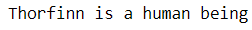
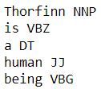
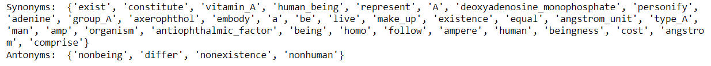

<H3>NAME: Bairav Skandan Loha</H3>
<H3>REGISTER NO: 212221230010</H3>
<H3>EX. NO: 6</H3>
<H3>DATE: 23/04/2024</H3>
<H1 ALIGN =CENTER>Implementation of Semantic ANalysis</H1>
<H3>Aim: to perform Parts of speech identification and Synonym using Natural Language Processing (NLP) techniques. </H3> 
 <BR>
<h3>Algorithm:</h3>
Step 1: Import the nltk library.<br>
Step 2: Download the 'punkt', 'wordnet', and 'averaged_perceptron_tagger' resources.<br>
Step 3:Accept user input for the text.<br>
Step 4:Tokenize the input text into words using the word_tokenize function.<br>
Step 5:Iterate through each word in the tokenized text.<br>
•	Perform part-of-speech tagging on the tokenized words using nltk.pos_tag.<br>
•	Print each word along with its corresponding part-of-speech tag.<br>
•	For each verb , iterate through its synsets (sets of synonyms) using wordnet.synsets(word).<br>
•	Extract synonyms and antonyms using lemma.name() and lemma.antonyms()[0].name() respectively.<br>
•	Print the unique sets of synonyms and antonyms.

## PROGRAM

```python
pip install nltk
```
```python
import nltk
nltk.download('punkt')
nltk.download('wordnet')
from nltk.tokenize import word_tokenize
nltk.download('averaged_perceptron_tagger')
sentence=input()
# Tokenize the sentence into words
words = word_tokenize(sentence)
# Identify the parts of speech for each word
pos_tags= nltk.pos_tag(words)
# Print the parts of speech
for word, tag in pos_tags:
	print(word, tag)
from nltk.corpus import wordnet
# Identify synonyms and antonyms for each word
synonyms =[]
antonyms =[]
for word in words:
	for syn in wordnet.synsets(word) :
		for lemma in syn.lemmas():
			synonyms.append(lemma.name())
			if lemma.antonyms():
				antonyms.append(lemma.antonyms()[0].name())
# Print the synonyms and antonyms
print("Synonyms: ", set(synonyms))
print("Antonyms: ", set(antonyms))
```
## OUTPUT







## RESULT

Thus, we have successfully implemented a program for Natural Language Processing.
